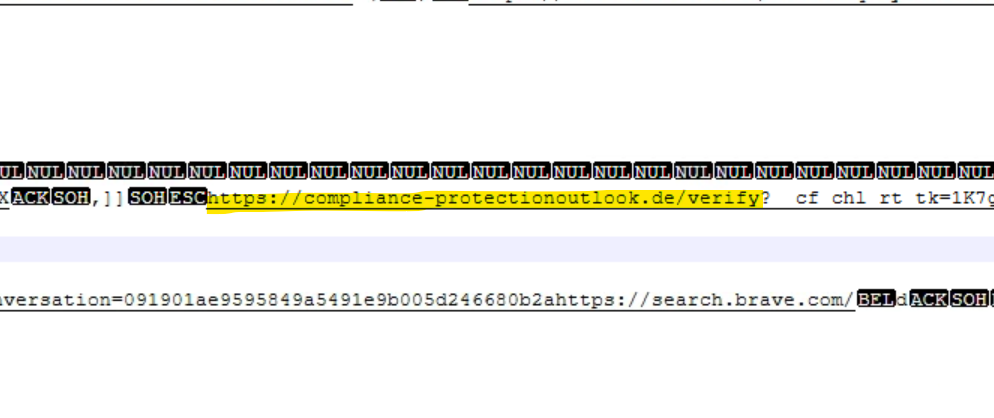
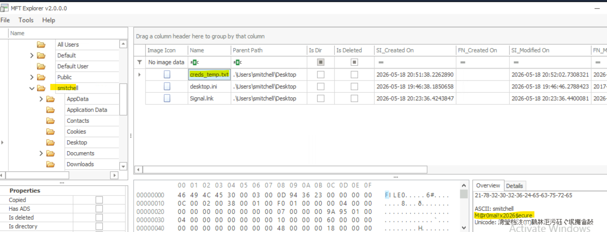
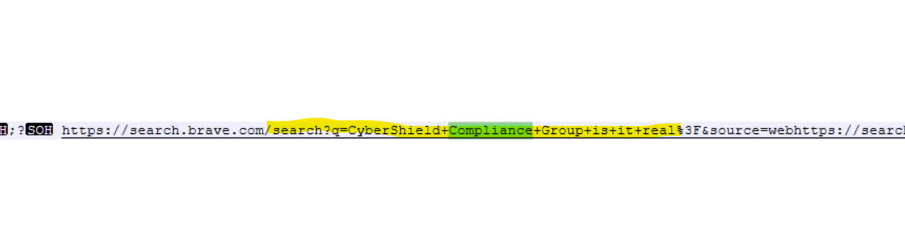
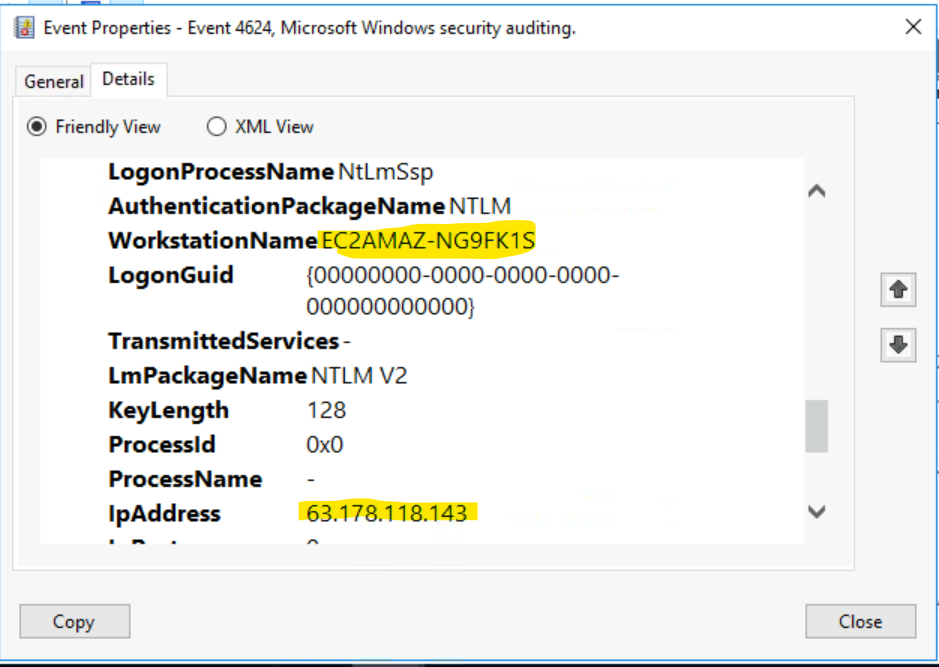
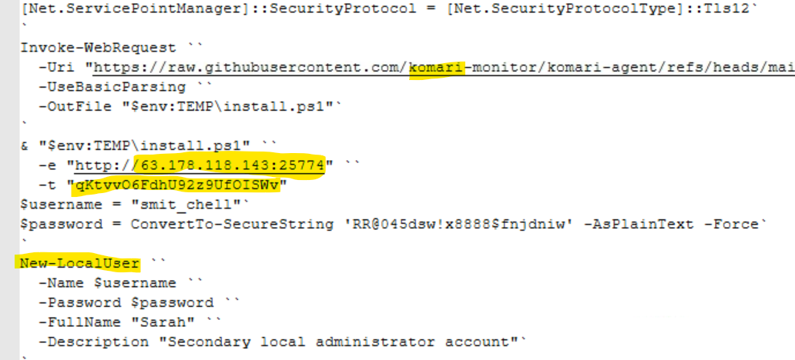
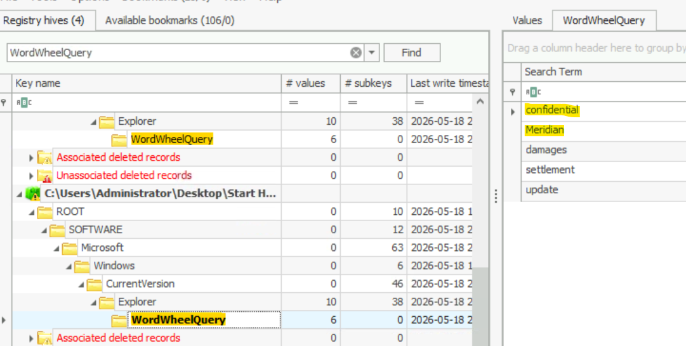
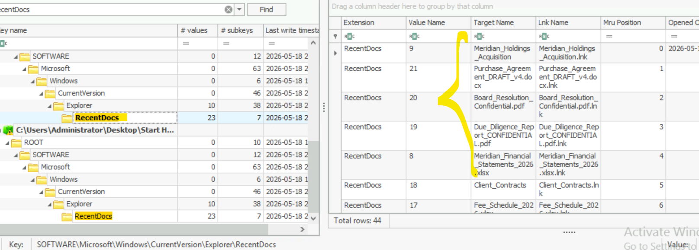
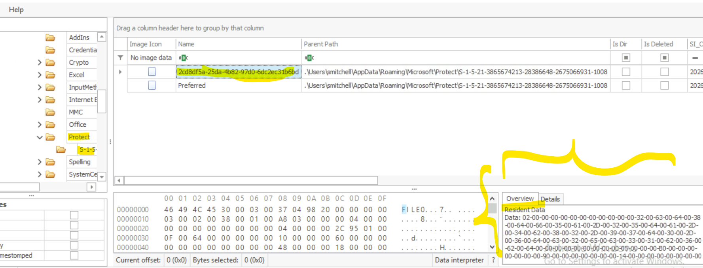
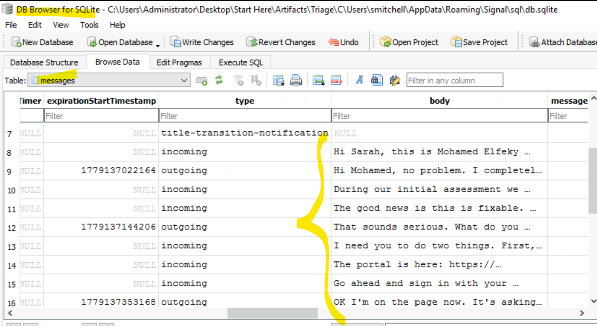

# Crossed Signals Lab (Medium)

## Quick Overview

This CyberDefenders lab is in the Endpoint Forensics category. The scenario: during a routine security audit, a trusted messaging app turns out to be the entry point for an attack — by the time the victim notices something's wrong, the damage is already done. The goal is to trace the whole thing from an endpoint forensics artifact set (triage image, memory-adjacent files, browser history, registry hives, etc).

**Tools I used:** MFT Explorer, Registry Explorer, mimikatz, DB Browser for SQLCipher, VirusTotal

**MITRE ATT&CK Tactics covered:** Initial Access, Persistence, Privilege Escalation, Stealth, Discovery, Collection, Command and Control

> **Disclaimer:** Some of the explanations and scripts in this writeup (mainly the PowerShell/Python steps in the Encrypted Communications Recovery section) were put together with help from AI. I reviewed and tested them, but wanted to be upfront about it rather than pass everything off as 100% from-scratch.

---

### Victim Environment

**Q01/** Brave, Signal

Easy start — you can find this just by browsing around the user's folders.

---

### Credential Access
*MITRE ATT&CK Tactics: Initial Access*

Starting here, I'd recommend opening **MFT Explorer** and loading the `$MFT` file found in the artifacts.

**Q02/** https://compliance-protectionoutlook.de/verify

**Q03/** Code of Conduct

Searching Brave's browser history (`C:\Users\Administrator\Desktop\Start Here\Artifacts\Triage\C\Users\smitchell\AppData\Local\BraveSoftware\Brave-Browser\User Data\Default\history`) gets you the answer for Q02. Keep searching around that same history and you'll find Q03 too.



**Q04/** C:\Users\smitchell\Desktop\creds_temp.txt

**Q05/** M@r0mal!x2026$ecure

Both of these show up in MFT Explorer.



**Q06/** CyberShield Compliance Group — turns out it's not a real organization.

Back to Brave history for this one.



---

### Remote Access & Persistence
*MITRE ATT&CK Tactics: Persistence, Privilege Escalation*

**Q07/** 63.178.118.143, 2026-05-18 21:16

**Q08/** EC2AMAZ-NG9FK1S, AWS

Found in the Windows Security event log by filtering on Event ID 4624 (Remote Interactive Logon). "AWS" is deduced from the hostname format (`EC2AMAZ-...`), which is the default naming pattern AWS gives EC2 instances.



**Q09/** Komari

**Q10/** 63.178.118.143:25774, qKtvvO6FdhU92z9UfOISWv

This info is in the PowerShell history file: `C:\Users\Administrator\Desktop\Start Here\Artifacts\Triage\C\Users\smitchell\AppData\Roaming\Microsoft\Windows\PowerShell\PSReadLine\ConsoleHost_history.txt`



**Q11/** T1136.001

As seen in the previous questions, the attacker created a local account to keep persistence on the machine. A quick search for "create local account MITRE technique" gets you this ATT&CK ID.

---

### Discovery & Collection
*MITRE ATT&CK Tactics: Discovery, Collection*

From here I used **Registry Explorer** and loaded both `smitchell` and `Administrator`'s `NTUSER.DAT`. When you open an `NTUSER.DAT` in Registry Explorer, make sure to also load its `.LOG1` and `.LOG2` files alongside it so you get the most recent data.

**Q12/** Meridian, confidential

Found under `NTUSER.DAT\Software\Microsoft\Windows\CurrentVersion\Explorer\WordWheelQuery`



**Q13/** Meridian_Holdings_Acquisition

**Q14/** 4, Meridian_Financial_Statements_2026.xlsx

Both found under `NTUSER.DAT\Software\Microsoft\Windows\CurrentVersion\Explorer\RecentDocs`



---

### Encrypted Communications Recovery
*MITRE ATT&CK Tactics: Collection, Command and Control*

This section is the hardest part of the lab. Before diving in, it's worth reading a bit about **DPAPI Masterkeys** and how **Signal's local encryption** works — it'll make the steps below much easier to follow.

**Q15/** 2cd8df5a-25da-4b82-97d0-6dc2ec31b6bd

Found through MFT Explorer.



**Q16/** 10005ec0b29400e813d11c48fbbd7b8a724b5d8a8b4dbfdd7cc375c4ea70069c

To get this hex key, there are three steps.

**Step 1 — rebuild the DPAPI Masterkey.** Since we found the raw data resident in the MFT, we can rebuild it as a real file using this PowerShell:

```powershell
$hexString = "02-00-00-00-00-00-00-00-00-00-00-00-32-00-63-00-64-00-38-00-64-00-66-00-35-00-61-00-2D-00-32-00-35-00-64-00-61-00-2D-00-34-00-62-00-38-00-32-00-2D-00-39-00-37-00-64-00-30-00-2D-00-36-00-64-00-63-00-32-00-65-00-63-00-33-00-31-00-62-00-36-00-62-00-64-00-00-00-00-00-00-00-00-00-05-00-00-00-B0-00-00-00-00-00-00-00-90-00-00-00-00-00-00-00-14-00-00-00-00-00-00-00-00-00-00-00-00-00-00-00-02-00-00-00-DF-E2-02-20-56-62-A1-AF-77-FA-54-09-4B-6A-A5-C7-40-1F-00-00-0E-80-00-00-10-66-00-00-94-FD-54-20-3D-A8-C8-3D-B4-09-71-5A-29-D0-31-21-74-D3-BF-AC-1A-91-C8-6B-78-60-D7-7C-1A-69-42-39-F8-72-2F-59-4D-38-F2-59-5B-02-D1-CE-DD-1C-60-93-54-22-28-18-EF-B6-D8-F8-6F-77-B3-EB-CD-DE-F3-9F-23-C9-83-DA-63-C7-A0-AD-6F-47-9C-2F-33-F4-1A-20-54-CB-3A-90-74-BA-42-94-AD-53-93-AD-2F-AA-05-21-04-CC-9E-DD-C7-19-57-A4-20-CA-7B-9A-B7-B8-30-59-BB-FF-2B-69-CF-AF-2E-52-F3-57-0D-A0-3F-AB-80-16-08-A2-4A-80-49-A0-D4-8E-79-C1-0C-A6-44-7A-74-74-02-00-00-00-9B-43-90-5B-9B-26-0B-EB-D3-E5-0D-4C-02-3B-AD-EF-40-1F-00-00-0E-80-00-00-10-66-00-00-90-6B-39-A9-42-55-A8-58-8D-20-FD-77-ED-67-76-BB-3C-E0-4D-69-10-A1-34-8B-D7-E2-AE-D0-2E-24-C9-A6-B6-E4-5E-81-DA-9E-29-72-1B-B4-08-C4-F7-AF-D7-BB-82-D3-33-67-32-E1-62-81-D4-08-0A-0A-BD-4C-4B-35-0C-F8-14-CD-4A-37-5A-21-C7-D8-DD-1C-DC-5C-3A-B4-64-A1-68-2C-F5-D0-1C-30-05-D8-FC-46-E0-31-00-BF-36-64-91-17-54-1D-39-DA-AC-15-F0-98-FC-00-14-68-03-00-00-00-7E-01-B2-21-E7-F0-50-43-B6-90-3E-3F-79-7F-2E-BA"

$bytes = $hexString -split '-' | ForEach-Object { [Convert]::ToByte($_, 16) }
[System.IO.File]::WriteAllBytes("C:\2cd8df5a-25da-4b82-97d0-6dc2ec31b6bd", [byte[]]$bytes)
Write-Host "Wrote $($bytes.Length) bytes"
```

**Step 2 — decrypt the Masterkey with mimikatz:**

```
mimikatz # dpapi::masterkey /in:"C:\2cd8df5a-25da-4b82-97d0-6dc2ec31b6bd" /sid:S-1-5-21-3865674213-28386648-2675066931-1008 /password:"M@r0mal!x2026$ecure"
```

**Step 3 — pull the encrypted key from Signal's local state file**, decode it from base64, and rebuild it as binary with PowerShell:

```powershell
$b64 = "RFBBUEkBAAAA0Iyd3wEV0RGMegDAT8KX6wEAAABa39gs2iWCS5fQbcLsMba9EAAAABIAAABDAGgAcgBvAG0AaQB1AG0AAAAQZgAAAAEAACAAAAAv/cgaJ/c5+KsGvIXYrvsFEXi+37W6oabacsIiOJBz1QAAAAAOgAAAAAIAACAAAAChReM3vjU7RdUHB/tjL3xlp9S1xGCYmWffSsq+olU1kTAAAADZoZR6jlU+VJJotjtvEuy3q2omGunumssweBbhxVY0afjM4t0/K0YO9aMjkVu9A+ZAAAAA4Tl9pFCRgskJIvh27ihNPBVti+z8zGZmpw6zZsFT13X7T9DYoMqCzSTRAPUBuWWOvm+bWFvSMzOc96Ulot6INA=="
$rawBytes = [System.Convert]::FromBase64String($b64)
$blobBytes = $rawBytes[5..($rawBytes.Length - 1)]   # strip "DPAPI" ASCII prefix
[System.IO.File]::WriteAllBytes("C:\signal_local_state_key_noprefix.bin", $blobBytes)
Write-Host "Wrote $($blobBytes.Length) bytes"
```

Now that the masterkey is decrypted, we can decrypt the Signal local state blob with mimikatz too:

```
mimikatz # dpapi::blob /in:"C:\signal_local_state_key_noprefix.bin" /masterkey:d0db37ab736930fea9d3834e41f9d1920cf0cbca5b89fc945dcb9e486ffde3ccec165225d1916185deadcdffb2e6da08be5a77c4b91f386f1dd3d10dcaba7fd6
```

And that gives us the Signal `safeStorage` key.

**Q17/** 0x985de0b2726e749152a1b329c33cc460d3498e890af9a60ca4f26ff5d7e97477

Next, we need the SQLCipher key. Using the encrypted key from Signal's `config.json` plus the key we just decrypted, we can run this AES-GCM decryption in Python:

```python
from cryptography.hazmat.primitives.ciphers.aead import AESGCM

key = bytes.fromhex("10005ec0b29400e813d11c48fbbd7b8a724b5d8a8b4dbfdd7cc375c4ea70069c")

# original Signal encryptedKey value — strip only the "v10" prefix, keep the rest
full_blob = bytes.fromhex("7631301ae35adb7db6aea9340340df401adb802d117b7dec7a2709af81429bc561db69f536775200e128588596cea57e13b214e459f38474fc343f5e0c69c4b5eee17d3dcb28d71f01c019252263b3865703ffed92a3930e37ab7206efedb1")

blob = full_blob[3:]  # strip "v10"
nonce = blob[:12]
ciphertext_and_tag = blob[12:]

aesgcm = AESGCM(key)
plaintext_key = aesgcm.decrypt(nonce, ciphertext_and_tag, None)
print("SQLCipher key:", plaintext_key.hex())
```

And that gives us the final key needed to open the Signal database.

**Q18/** 2026-05-18 20:41, Mohamed Elfeky

**Q19/** ABA Opinion 477R

**Q20/** You already did

These last three are all found in the decrypted database messages. Note: timestamps in the DB are Unix time (e.g. `1779135823`).



---

## Conclusion

This one was way more involved than my last writeup — way less "filter and read," way more "chain three tools together and hope you didn't mess up a byte order somewhere." The DPAPI/mimikatz/SQLCipher chain to get into the Signal database was honestly the most satisfying part: rebuilding a masterkey from raw MFT-resident bytes, decrypting it, then using it to unwrap Signal's local state, then using *that* to finally unwrap the database key — it's a real rabbit hole, but each step made sense once I understood what DPAPI was actually doing under the hood.

Biggest lesson from this lab: even an end-to-end encrypted messenger like Signal is only as safe as the machine it's running on. Once an attacker has local access and the right credentials, DPAPI (which is meant to protect secrets at rest) can be unwound step by step to get straight into supposedly "secure" conversations.

Also a good reminder to always check browser history early — a lot of the initial-access story here (the fake compliance email, the fake "CyberShield Compliance Group") was sitting right there in Brave's history the whole time.

