---
# MiniFast - UNC1549 Lab (Medium)
---
## Quick overview

CyberDefenders lab based on investagating and analysing a network traffic PCAP, and reconstruction the attack chains through the bellow questions/responds.

---

### Delivery Analysis

**Q01/** getsqldeveloper.it.com

**Q02/** 63.176.135.137

we can answer Q1 and Q2 from wireshark resolved addresses

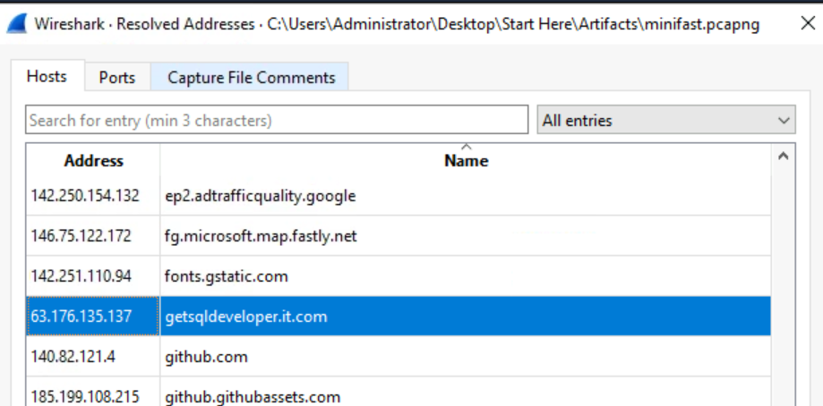

**Q03/** UpdateChecker.dll

**Q04/** E5DFF97693BE9D53E401B2DB84FF6D9C1808300876EE7C2C1FB4FC00AB7FB4FB

the Q3 question get a little bit conmplicated, because the traffic is encrypted. so first we get all the strings from msedge.DPM.

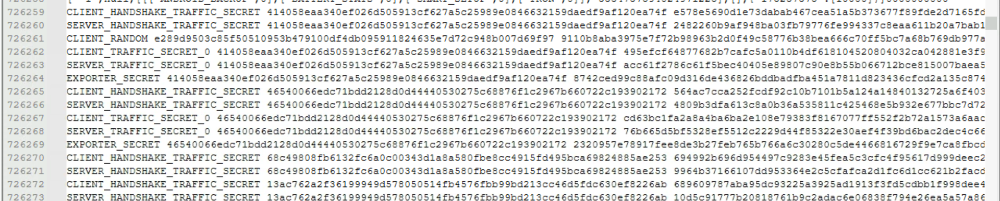

we search for all the keys, and we copy them in another file, we upload that file into wireshark.

- i recommend to read a little bit about TLS encryption and its keys -

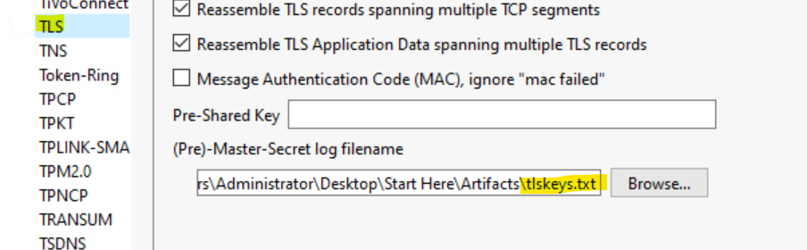

then we can get the DLL file from HTTP export, since now its decrypted, and lastly we calcul its hash.

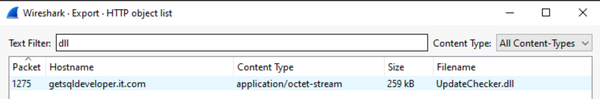

---

### C2 Analysis

**Q05/** 35.159.37.95

**Q06/** updates.getsqldeveloper.it.com

got the Q06 before the Q05, by searching for any exe file in HTTP export

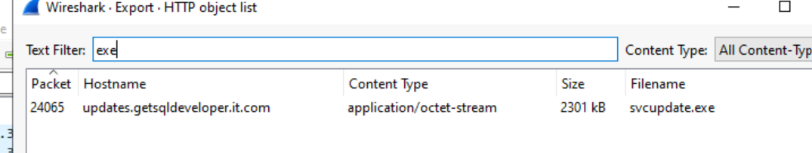

and the IP address from VirusTotal

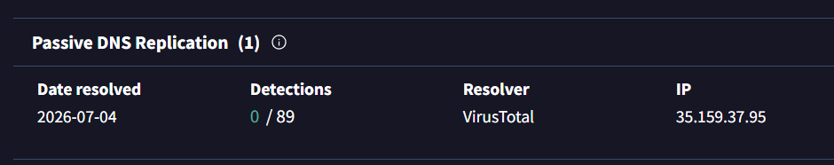

**Q07/** /rg

**Q08/** 400

**Q09/** e4e9281c9c82ea3ab8850120714c1c26

**Q10/** 30000

**Q11/** 146

the rest of question are in the are in HTTP stream 47

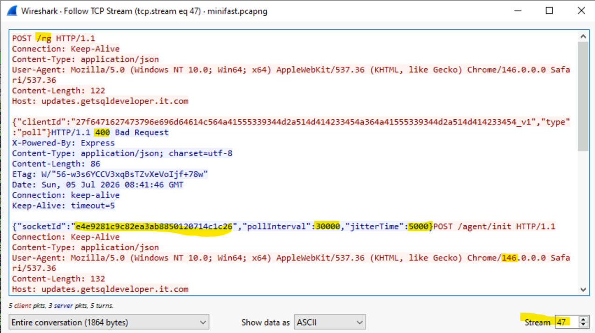

---

### Discovery

**Q12/** EC2AMAZ-D93UQJF

**Q13/** Administrator

Q12 and Q13 same in HTTP stream 47

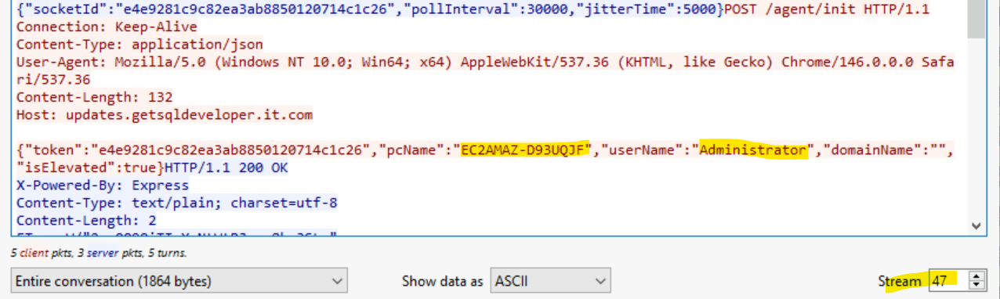

**Q14/** 11

in HTTP stream 99, there is double BASE64 encode, decode first round, you will seperate BASE64 parts, decode them again and you will get 11 commands 

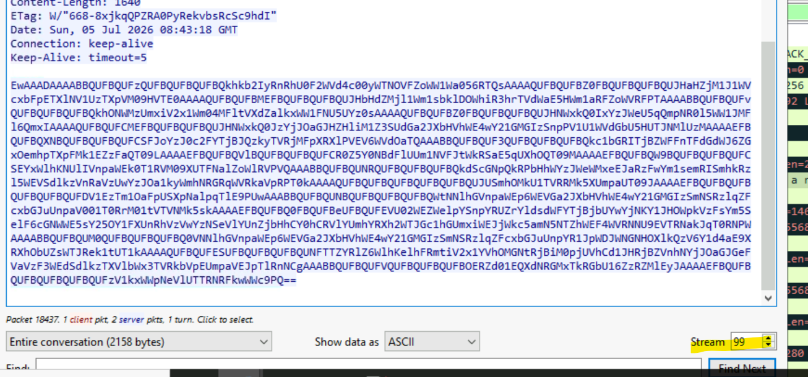

---

### Collection and Exfiltration

**Q15/** PUT

**Q16/** db_export.sql

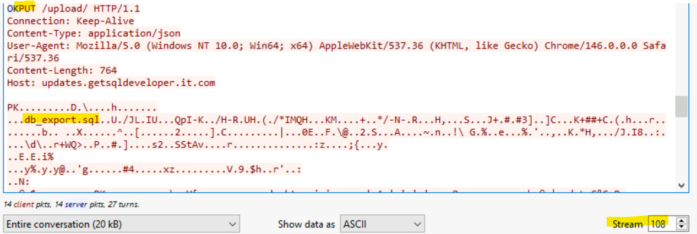

**Q17/** svc_crewsync:Av1@tion-Cr3w#2026

**Q18/** sqldev-prod-01.corp.aero

generally its PUT, so if you filter by HTTP.Request.method==PUT, and follow the founded stream 108, you can found all the answers.

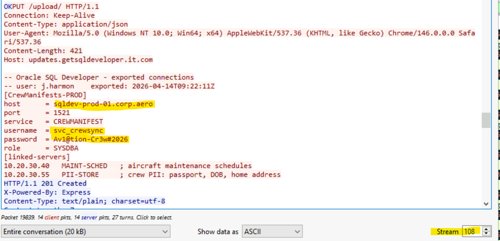

---

### Second Stage

**Q19/** svcupdate.exe

**Q20/** D13377117414E8E18498F5338E8B3474F8EC78729BF4DC880808824B0CEC41A2

we get file from HTTP export, and calcul its hash

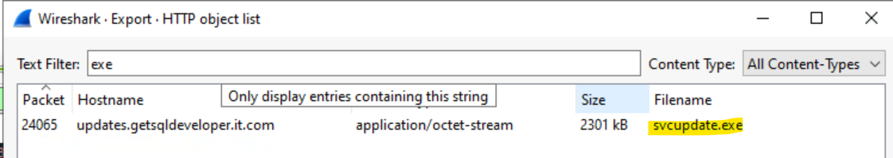

**Q21/** ransomware

**Q22/** NoMatter

by searching the hash in VirusTotal we can answer the two last questions

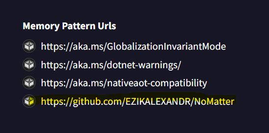

---
